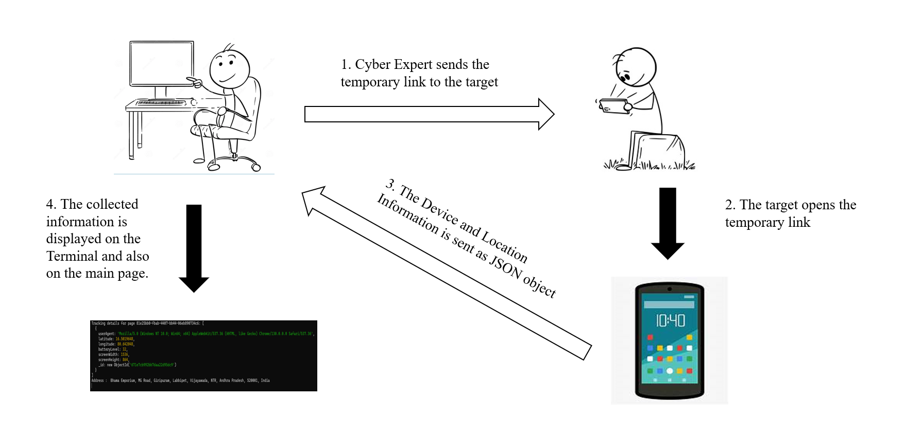

# Trackable Pages

## Overview
**Trackable Pages** is a web-based tool that allows you to track the location, device information, and IP address of a person by sharing a unique link. The system is designed to create a duplicate URL from any legitimate website URL you enter. When the target clicks the link, they are seamlessly redirected to the legitimate page while the tracking information is sent to your server. This can be used for security purposes, user behavior tracking, or any other legitimate use case where tracking is necessary.

## How It Works
1. Enter the URL of a legitimate website in the provided input area.
2. A unique, duplicate URL is generated for you to share with someone.
3. When the recipient opens the link:
   - They are redirected to the legitimate website.
   - Meanwhile, details like their location, device information, and IP address are sent to the server for logging and analysis.
The working of the Tracker is shown in the mechanism given below:



## Key Features
- **Real-time Tracking**: Captures location, device information, and IP address as soon as the link is accessed.
- **Seamless Redirection**: The recipient is automatically redirected to the legitimate URL without any interruptions.
- **Easy-to-Use Interface**: Simply input a URL and get a trackable link with no extra steps.
- **No User Awareness**: The recipient is unaware of the tracking process as they are instantly taken to the legitimate site.

## Technologies Used
- **HTML**: For the front-end structure and UI elements.
- **JavaScript**: To handle link generation and tracking processes.
- **Node.js**: For backend handling, including the tracking mechanism and server-side operations.
The User Interface of the application is very easy to navigate and looks like the image given below:


## Setup Instructions
1. **Create a New Project**:
   - First, create a new project folder on your system:
     ```bash
     mkdir <project_folder>
     cd <project_folder>
     ```

2. **Clone the Repository from GitHub**:
   - Now, clone the repository into your project folder:
     ```bash
     git clone https://github.com/Bhargavmupparisetty/Trackable-pages.git
     ```

3. **change repo**:
   - Change the repository to the Trackable-pages:
     ```bash
     cd Trackable-pages
     npm install
     ```

4. **Run the Application**:
   - Start the application by running:
     ```bash
     node server.js
     ```
   
5. **Access the Application**:
   - Open your browser and navigate to `http://localhost:3000` to use the tool.

## Usage
1. Input the URL of a legitimate website you want to track.
2. Share the generated URL with the intended person.
3. Track their location, IP, and device details from your server logs or they can also be displayed on the main page.

## Legal Considerations
This tool should be used responsibly and within legal boundaries. Ensure that all usage complies with data protection and privacy laws in your jurisdiction. Misuse of this tool can lead to legal consequences.

## Live Demo

You can try the live version of this tool hosted on Render:

 [Live Tracker on Render](https://trackable-pages.onrender.com)


## License
This project is licensed under the MIT License. See the [LICENSE](LICENSE) file for more details.

## Author
Bhargav Mupparisetty


